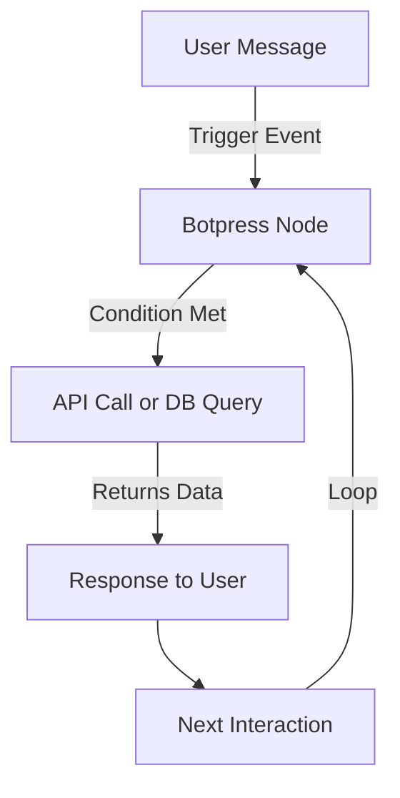

# Passion: AI-Powered Node-Based Chatbot  

**Passion** is an advanced **AI-powered chatbot** built using **Botpress** and **JavaScript**, designed for **intelligent, natural, and dynamic conversations**. With multi-platform support, Passion seamlessly integrates with **web platforms, WhatsApp, and Botpress Cloud**, offering a highly interactive and feature-rich experience.  

Powered by **natural language processing (NLP)** and enhanced with APIs, Passion can:  
✅ Recognize and convert English **speech to text**  
✅ Send and receive **emails**  
✅ Play **music** on demand  [Website Only]
✅ **Query databases** for real-time information  
✅ **Integrate with APIs & webhooks** for enhanced automation  

>[!TIP]
> For the **best experience**, use **Passion’s website version**, which provides the **fullest range of features**. This version can be found on [My Website](https://tinotenda-mhedziso.pages.dev/).

---

## 📌 Table of Contents  
- [🚀 Features](#-features)  
- [🛠️ Bot Anatomy](#-bot-anatomy)  
- [💡 How It Works](#-how-it-works)  
- [📌 Deployment Platforms](#-deployment-platforms)    
- [📜 License](#-license)  

---

## 🚀 Features  

🔹 **Conversational AI** – Passion understands **contextual conversations**, thanks to **GPT-4 integration**.  
🔹 **Multi-Platform Deployment** – Available on **Botpress Cloud, Website, and WhatsApp**.  
🔹 **Speech-to-Text** – Converts spoken **English** into text for smooth interaction.  
🔹 **Email Communication** – Send & receive emails directly from the chatbot.  
🔹 **Music Playback** – Users can request and play songs via voice/text commands.  
🔹 **Database Integration** – Queries **databases** dynamically based on user input.  
🔹 **Webhook & API Support** – Integrates with **external APIs** for automation.  

---

## 🛠️ Bot Anatomy  

Passion is a **node-based chatbot**, meaning that conversations flow from **one entry point** to another based on **user actions**. Below is the core architecture:  

### 🔹 **Nodes & Flow**  
- Each conversation **begins at an entry point** and moves **node-to-node**.  
- The bot **follows user inputs** to determine the next logical step.  

### 🔹 **Triggers**  
- **Define how conversations start** (e.g., user sends a message, selects a choice, or triggers an event).  
- Examples: "Hello", "Start", or a **WhatsApp message** received.  

### 🔹 **Events**  
- Events handle **real-time interactions**, such as API responses, webhook triggers, or system notifications.  
- Example: A **database query returns data**, and Passion uses that to **continue the conversation**.  

### 🔹 **Memory & Context**  
- The bot **remembers user inputs** within the session, allowing for **context-aware conversations**.  

📌 **Diagram: Node-Based Conversation Flow**  

## 💡 How It Works  

Passion operates as a **node-based chatbot**, meaning conversations follow a **structured flow**, transitioning between different **nodes** based on user interactions.  

### 🔹 Step-by-Step Process  

1️⃣ **User initiates a conversation**  
   - A **trigger** (e.g., a message, button click, or system event) activates Passion.  

2️⃣ **Node-based navigation**  
   - Passion moves through **predefined conversation paths** based on **user input and system logic**.  

3️⃣ **Decision-making**  
   - Conditions determine **which path** the conversation follows (e.g., user choices, API responses).  

4️⃣ **Execution of actions**  
   - Passion can **send emails, fetch database records, recognize speech, or play music**, depending on the interaction.  

5️⃣ **Real-time response generation**  
   - Using **GPT-4 and NLP techniques**, Passion **understands context** and responds dynamically.

---

## 🌍 Deployment Platforms  

Passion is deployed across three platforms, each offering different levels of functionality.  

| Platform            | Description | Features | Limitations |
|---------------------|-------------|-----------|-------------|
| **Botpress Cloud** (Native Link) | The default hosting option for quick testing and deployment. | 🔹 Basic chatbot functionality | 🔹 Limited customization |
| **Website Integration** (Recommended) | Hosted on my personal website, offering the most advanced functionality. | 🔹 Email interactions (send/receive)   🔹 Speech recognition (convert speech to text)   🔹 Music playback   🔹 Database queries & API integrations | 🔹 None (Best experience) |
| **WhatsApp Business** | Integrated via a **WhatsApp Business account**, best for quick, text-based interactions. | 🔹 Supports standard chatbot conversations | 🔹 Limited multimedia support   🔹 No speech recognition or music playback |

📌 **Recommendation:**  
For the **best experience**, use Passion’s **website version**, as it supports **all features** without platform limitations.  

---
## License  

Copyright (c) 2025 Tinotenda Mhedziso. All Rights Reserved.

This software, its source code, and all related materials are proprietary and owned solely by [Tinotenda Mhedziso].  
Unauthorized copying, modification, distribution, or resale of this software, in whole or in part, is strictly prohibited. Please see the LICENSE file.

---

  <a href="https://dev.to/passionoverpain">Dev.to</a> |
  <a href="mailto:tinomhedziso21@gmail.com">Email</a> |
  <a href="https://github.com/Passion-Over-Pain">GitHub</a> |
  <a href="https://www.linkedin.com/in/tinotenda-mhedziso/">LinkedIn</a> |
  <a href="https://tinotenda-mhedziso.pages.dev/">Website</a>

